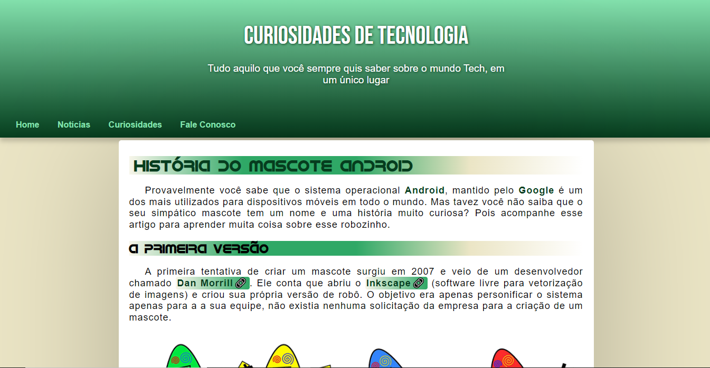
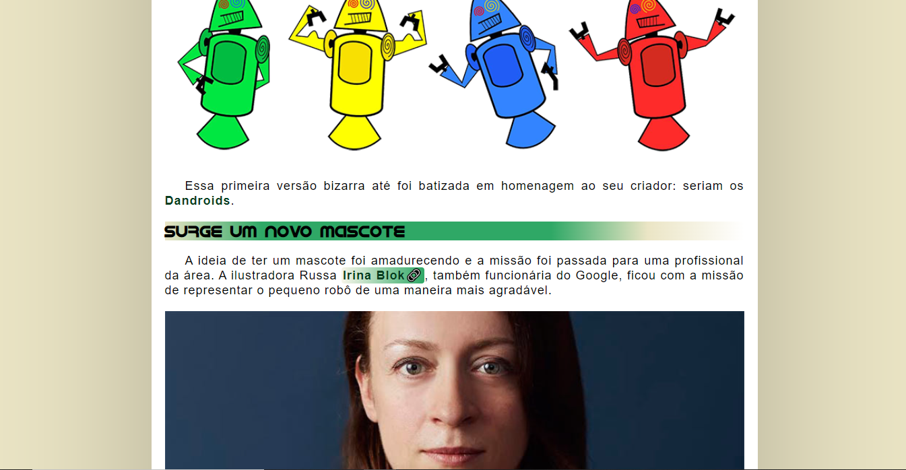
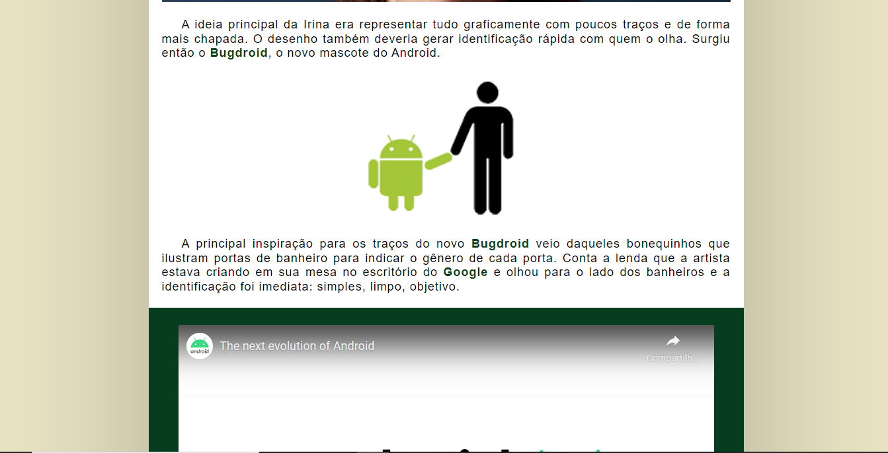
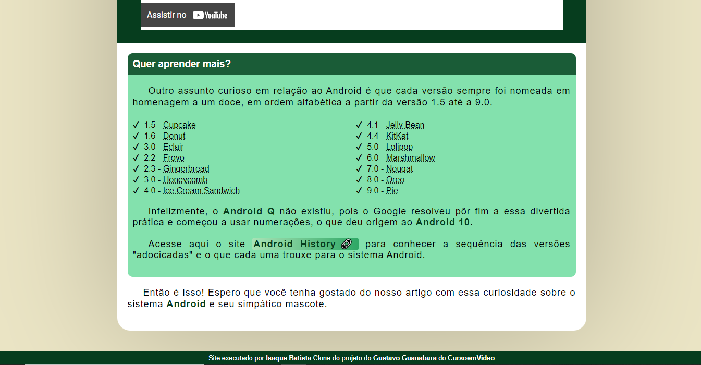

# História do Mascote Android

> This project is being developed to help you understand the History of the Android Mascot.

### Adjustments and improvements.

The project is still in development and the next updates will focus on the following tasks:

- [x] task 1 (Example 1)
- [x] task 2 (Example 2)
- [x] task 3 (Example 3)
- [ ] task 4 (Example 4)
- [ ] task 5 (Example 5)

 
## 🤝 Contributors

We thank the following people who contributed to this project:

<table>
  <tr>
      <td align="center">
          <a href="https://github.com/IsaqueBatista">
                 
                
                <b>Isaque Batista</b>
                
         </a>
      </td>
      <td align="center">
          <a href="https://github.com/gustavoguanabara">
                 
                
                <b>Gustavo Guanabara</b>
                
         </a>
      </td>
  </tr>
  
</table>
